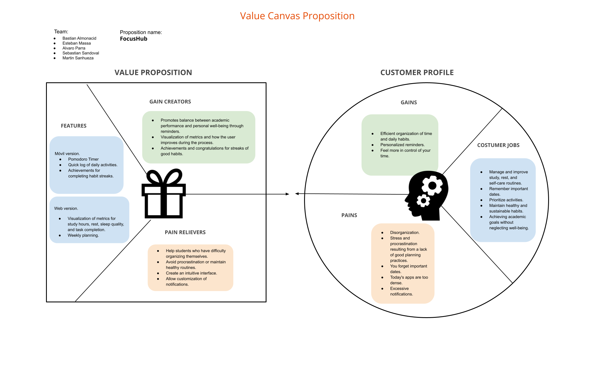

# Focus Hub

An application that helps university students manage their habits, tasks, and well-being with features like Pomodoro, reminders, and progress tracking, focusing on simplicity and motivation.

## Index

- [1. Introduction](#1-introduction)
  - [1.1. The Problem](#11-the-problem)
  - [1.2. Our Solution](#12-our-solution)
- [2. Team & Roles](#2-team--roles)
- [3. Strategy](#3-strategy)
  - [3.1. Value Proposition Canvas](#31-value-proposition-canvas)
  - [3.2. UX Personas](#32-ux-personas)
  - [3.3. Benchmarking](#33-benchmarking)
- [4. Scope](#4-scope)
  - [4.1 Customer Journey Map](#41-customer-journey-map)
    - [4.1.1 Decision Stage Interfaces](#411-decision-stage-interfaces)
- [5. Structure](#5-structure)
  - [5.1. Navigation Flow](#51-navigation-flow)
- [6. Skeleton](#6-skeleton)
  - [6.1. Low-Fi Wireframes](#62-low-fi-wireframes)
- [7. Surface](#z7-surface)
  - [7.1. High Definition Interfaces](#71-high-definition-interfaces)
  - [7.2. Interface Evolution](#72-ui-evolution)
  - [7.3. Results of the Heuristic Evaluation](#73-results-of-the-heuristic-evaluation)
  

---

## 1. Introduction

### 1.1. **The Problem**

> How can university students maintain healthy study, rest, and self-care habits while managing a demanding routine full of responsibilities?

University students often struggle to balance academic demands with personal well-being, facing stress, fatigue, and disorganization due to irregular study habits and poor time management. Existing tools tend to address either productivity or wellness in isolation, leaving students without integrated support to manage tasks, build healthy routines, and sustain motivation over time.

There is a clear need for a comprehensive solution that unites academic productivity and personal well-being, offering accessible, motivating, and intuitive tools that encourage discipline, reduce stress, and promote lasting healthy habits.

### 1.2. **Our Solution**

This project proposes the design of a web and mobile application that helps university students improve productivity while maintaining personal well-being. The mobile app supports daily use with tools such as a Pomodoro-style focus timer, intelligent reminders, quick activity tracking, and gamification features like streaks and achievements to sustain motivation.

The web version acts as a more complete control panel, allowing students to review metrics, visualize habits, analyze progress, and plan their week through an integrated calendar. With an emphasis on simplicity, accessibility, and motivation, the system provides an intuitive and calming interface that promotes both academic performance and healthier lifestyle habits.

---

## 2. Team & Roles

Alvaro Parra        - Project Manager

Bastian Almonacid   - Analyst

Sebastian Sandoval  - Designer

Martin Sanhueza     - Presenter

Esteban Massa       - Presenter

---

## 3. Strategy

### 3.1. Value Proposition Canvas

### 3.2. UX Personas

### 3.3. Benchmarking

## 5. Structure

### 5.1. Navigation Flow

## 6. Strategy

### 6.1. [Low-Fi Wireframes](./docs/wireframes.pdf)

## 7. Surface

### 7.1. [High Definition Interfaces](./docs/mockups.pdf)
